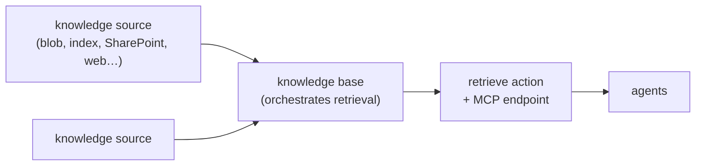

# Foundry IQ — Knowledge Bases for MAF Agents

Foundry IQ is Microsoft Foundry's **managed knowledge layer**. It is not a new retrieval
engine: it is Azure AI Search agentic retrieval, packaged as reusable, permission-aware
objects that many agents can share. Everything below is Azure AI Search underneath, so the
search-service API version — not the Foundry portal — decides what you can actually do.

Depth lives in references. Load one only when the task needs it.

| Task | Reference |
|---|---|
| Pick a source kind, ingest, re-index, change or delete a knowledge source | [references/knowledge-sources.md](references/knowledge-sources.md) |
| Provision it: regions, tiers, RBAC, models, env vars, verification, first-run errors | [references/setup.md](references/setup.md) |
| Consume it from MAF, from `FoundryAgent`, or from the voice loop | [references/wiring.md](references/wiring.md) |

Sibling skills: [maf-foundry-agent](../maf-foundry-agent/SKILL.md) owns the agent itself and
the non-Foundry-IQ retrieval strategies (hosted `file_search`, plain semantic search);
[maf-agent-config](../maf-agent-config/SKILL.md) owns the YAML this is declared in;
[maf-voice-agent](../maf-voice-agent/SKILL.md) owns the GA rules that still apply here.

## Object model

Three objects, created in this order, all on the **same search service**:



| Object | What it is | Reused by |
|---|---|---|
| **Knowledge source** | A connection to content — indexed (ingested into a search index) or remote (queried live) | many knowledge bases |
| **Knowledge base** | The top-level object that lists sources, an optional LLM, and default retrieval behaviour | many agents |
| **Agentic retrieval** | Decompose → run subqueries in parallel → semantic rerank → unify, with citations | — |

A knowledge base is *not* an index and *not* an agent. Do not create one per agent, and do
not create one per index — the whole point is that one knowledge base fans out across sources.

Foundry IQ is one of three "IQ" layers. **Fabric IQ** = analytics/ontologies in Fabric,
**Work IQ** = Microsoft 365 collaboration signal, **Foundry IQ** = enterprise content for
agents. Work IQ and Fabric surfaces are reachable *as knowledge sources* from Foundry IQ; do
not model them as separate retrieval stacks.

## Decide first: do you need Foundry IQ at all?

Adding a knowledge base when a vector store would do is the most common over-build here.

| Situation | Use |
|---|---|
| Corpus is a pile of files you can upload; one agent; no ACLs | hosted `file_search` — see [maf-foundry-agent/references/retrieval.md](../maf-foundry-agent/references/retrieval.md) |
| One existing index, single-hop questions, latency-critical (voice) | `AzureAISearchContextProvider`, `mode="semantic"` |
| **Several sources**, or content that must be re-used by several agents | **Foundry IQ knowledge base** |
| Multi-hop / comparative questions worth a query-planning round trip | Foundry IQ, `low` or `medium` reasoning effort |
| Per-caller document permissions (ACLs, RBAC scopes, Purview labels) | Foundry IQ — nothing else in this stack enforces them |

## The API-version decision (make it explicitly, in one place)

| | `2026-04-01` (GA) | `2026-05-01-preview` |
|---|---|---|
| Package | `pip install azure-search-documents` | `pip install --pre azure-search-documents` |
| Query input | `intents=[...]` only | `messages=[...]` (chat-shaped) |
| Reasoning effort | `minimal` only — no LLM | `minimal` \| `low` \| `medium` |
| Output mode | `extractedData` only | `+ answerSynthesis` |
| LLM on the KB | web knowledge sources only | any source |
| Permission enforcement | ❌ | `ingestionPermissionOptions` + `x-ms-query-source-authorization` |
| Preview source kinds (SQL, file, SharePoint, Fabric, MCP, Work IQ) | ❌ | ✅ |
| Sensitivity labels, image serving, CORS | ❌ | ✅ |

The Azure portal and the Foundry portal always talk preview. So a knowledge base that works
in the playground can fail from GA code. **Pin the API version in `infra/` and in settings,
never inline**, and state in a comment why preview was chosen if it was.

Rule for this repo: default to GA. Move to preview only for a named capability — almost
always document-level permissions or answer synthesis — and gate it behind a feature flag.

## Retrieval reasoning effort — the cost and latency dial

| Effort | LLM involved | Behaviour | Use for |
|---|---|---|---|
| `minimal` | none | Query string goes straight to keyword/vector/hybrid search | **voice**, high QPS, single source |
| `low` | yes | LLM plans subqueries and selects sources | multi-source text chat |
| `medium` | yes | Adds an iterative second pass | multi-hop research, offline |

`answerSynthesis` requires `low` or `medium`. `minimal` + `answerSynthesis` is rejected.

Source selection at `low`/`medium` is driven by the knowledge source `name`, the index
`description`, and the knowledge base `retrievalInstructions`. Those three are prompt surface —
write them like prompts, keep them in config, and treat a rename as a behaviour change.

## Minimum viable knowledge base

```python
from azure.identity import DefaultAzureCredential
from azure.search.documents.indexes import SearchIndexClient
from azure.search.documents.indexes.models import KnowledgeBase, KnowledgeSourceReference

index_client = SearchIndexClient(endpoint=search_endpoint, credential=DefaultAzureCredential())

index_client.create_or_update_knowledge_base(
    KnowledgeBase(
        name="policy-kb",
        description="Answers HR and travel policy questions.",
        knowledge_sources=[
            KnowledgeSourceReference(name="hr-policy-ks"),
            KnowledgeSourceReference(name="travel-policy-ks"),
        ],
    )
)
```

This belongs in `infra/`, not in request handling. Creating or updating a knowledge base on
every replica start is a provisioning bug, and knowledge source creation kicks off an indexer
pipeline you do not want re-triggered by an autoscale event.

## Querying: the retrieve action

```python
from azure.search.documents.knowledgebases import KnowledgeBaseRetrievalClient
from azure.search.documents.knowledgebases.models import (
    KnowledgeBaseRetrievalRequest, KnowledgeRetrievalSemanticIntent,
)

kb = KnowledgeBaseRetrievalClient(
    endpoint=search_endpoint, knowledge_base_name="policy-kb", credential=credential,
)
result = kb.retrieve(
    KnowledgeBaseRetrievalRequest(
        intents=[KnowledgeRetrievalSemanticIntent(search=user_question)],
    )
)
grounding = result.response[0].content[0].text   # JSON-encoded chunks with ref_id
```

The response has three parts, and you need all three:

| Part | Contains | Use it for |
|---|---|---|
| `response` | one JSON-encoded string of ranked chunks, each with `ref_id` | the grounding data you hand the model |
| `activity` | query plan, per-source timings, token counts, `modelName`, errors | cost attribution and latency debugging — log it |
| `references` | `docKey`, `activitySource`, optional `sourceData` | citations back to real documents |

`ref_id` in the grounding string joins to `references[].id`. That join is how you build a
citation; without it the model will invent source names.

Request knobs worth knowing, all optional:

| Knob | Effect |
|---|---|
| `max_output_size` | token budget for the grounding string. Too low ⇒ silently empty responses |
| `max_output_documents` | hard cap on returned grounding docs — use when you need a predictable citation count |
| `max_runtime_in_seconds` | latency ceiling on the whole request |
| `include_activity` | off by default; turn it on in dev and in traces |
| `filter_add_on` (per source) | OData filter on a search-index source — **this is your security trim** |
| `always_query_source` / `fail_on_error` (per source) | force selection / make a source required (`502` if it fails) |

## Security — read this before wiring anything

Foundry IQ can be permission-aware. It is **not permission-aware by default**, and the failure
mode is silent over-disclosure.

1. **No user token ⇒ unfiltered results.** If you omit `x-ms-query-source-authorization`,
   permission-enabled sources return everything. There is no error.
2. **No `ingestionPermissionOptions` ⇒ the header does nothing.** Permission metadata has to
   be ingested at knowledge-source creation. Adding it later means recreating the source.
3. **The user token is separate from the service credential.** Service credential authenticates
   *to* the search service; the user token (scope `https://search.azure.com/.default`) says
   *whose* access is evaluated. Derive it from the authenticated session — never from anything
   the caller typed or said.
4. **Foundry Agent Service MCP tools cannot vary headers per request** in preview. Headers on
   an agent definition apply to every invocation. So the topology-A path (voice → Foundry agent
   → MCP knowledge base) **cannot do per-caller trimming**. If callers must see different
   documents, retrieve from your own process (topology B) and pass the token yourself.
5. **Retrieved content is untrusted input.** A document saying "ignore previous instructions"
   is an injection vector. Grounding data never carries authority over system instructions.
6. Prefer Entra ID over admin keys everywhere. An admin key on the MCP endpoint is full
   read-write on the search service — dev only.

## Instructions that actually get the knowledge base called

Agents skip retrieval tools far more often than teams expect. Put this in
`config/agents/<name>.agent.yaml`, not in Python:

```yaml
instructions: |
  Use the knowledge base tool to answer user questions about policy.
  Never answer policy questions from your own knowledge.
  If the knowledge base does not contain the answer, say "I don't know" and offer to escalate.
  Cite the source document for every factual claim.
```

Explicit "never answer from your own knowledge" is what moves invocation rates. In a voice
channel, additionally instruct the model to summarize rather than read passages verbatim, and
never to speak `ref_id`s or document keys aloud.

## Voice-specific guidance

- Agentic retrieval with `low`/`medium` effort adds an LLM round trip **inside** retrieval.
  The caller hears that as dead air. Default voice to `minimal`.
- If you need planning or synthesis in voice, expose retrieval as a **tool** and pair it with a
  VoiceLive interim response (`InterimResponseTrigger.TOOL`). See
  [voicelive-realtime](../voicelive-realtime/SKILL.md).
- Cap `max_output_documents` at 3 and set `max_runtime_in_seconds`. An unbounded retrieve is a
  hung turn.
- `answerSynthesis` returns prose written to be read. Have the agent re-say it, not relay it.

## Troubleshooting

| Symptom | Cause |
|---|---|
| `200 OK`, empty references, activity says matches found | Top document exceeded `maxOutputSize` — raise it, or chunk the source smaller |
| `400 Bad Request` naming a knowledge source | `knowledgeSourceName` not attached to the KB, or `kind` mismatch |
| `400` on `includeReferenceSourceData` | It requires `includeReferences` |
| `206 Partial Content` | One source failed; inspect the `activity` entry carrying `error`. Others succeeded |
| `502 Bad Gateway` | Every selected source failed, **or** a `failOnError: true` source failed. Not an outage — read the underlying source error |
| `answerSynthesis` / `medium` rejected | Stable `azure-search-documents` — install `--pre` |
| `messages` input rejected | Same: GA accepts `intents` only |
| Model deployment not found from the KB | Search service managed identity lacks **Cognitive Services User** on the Foundry resource |
| `403` from search on the agent path | Project managed identity lacks **Search Index Data Reader** |
| `404` on the MCP endpoint | Wrong service URL, wrong KB name, or an api-version the MCP endpoint does not accept |
| Permission filtering has no effect | `ingestionPermissionOptions` was never set — recreate the knowledge source |
| Vector fields silently ignored | Index has vector fields but no vectorizer definition |
| Recency ranking not applied | Agentic retrieval ignores scoring profiles; use freshness-aware retrieval instead |
| `DefaultsNotSet` creating a blob source | `contentExtractionMode: standard` needs Content Understanding defaults set first |

## Anti-patterns

| Pattern | Verdict |
|---|---|
| Knowledge base or knowledge source created at request time / on startup | Provision in `infra/`. Creation triggers indexer pipelines |
| One knowledge base per agent | Defeats the reuse model. One per *knowledge domain* |
| Editing the generated datasource/skillset/indexer/index of a knowledge source | Unsupported; breaks the pipeline. Change the knowledge source definition instead |
| Deleting a knowledge source still referenced by a knowledge base | Fails. Update or delete the KB first |
| `retrieve()` without a security-trimming `filter_add_on` or user token on shared content | Every caller reads every document |
| Security filter or memory `scope` built from transcript text | Untrusted input — bind from the authenticated session |
| API version chosen implicitly by whatever package happens to be installed | Pin it; a `--pre` install silently changes behaviour |
| Admin key in the MCP tool `api-key` header outside local dev | Full read-write on the search service |
| `low`/`medium` reasoning effort in a voice turn | Audible dead air |
| Knowledge base LLM assumed to be the agent's model | Separate deployment, separate cost line, separate supported-model list |
